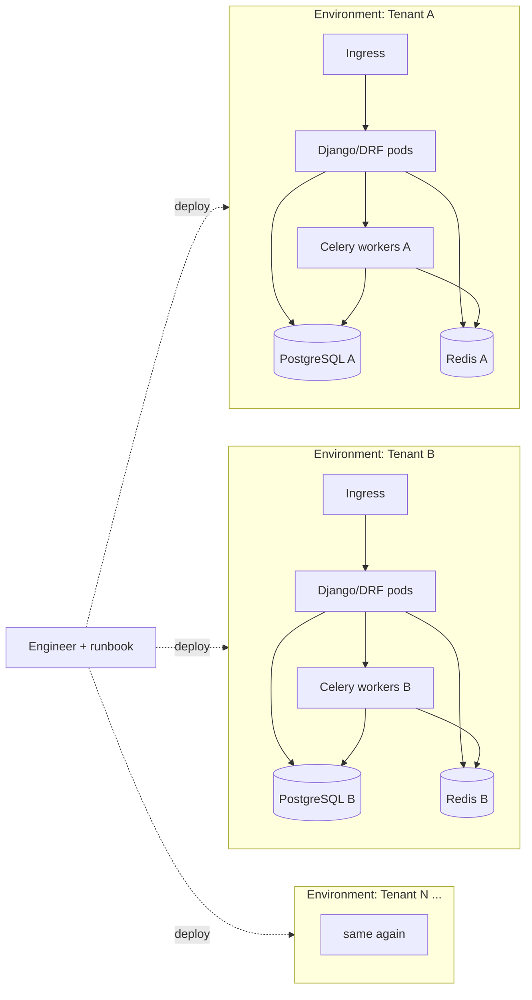
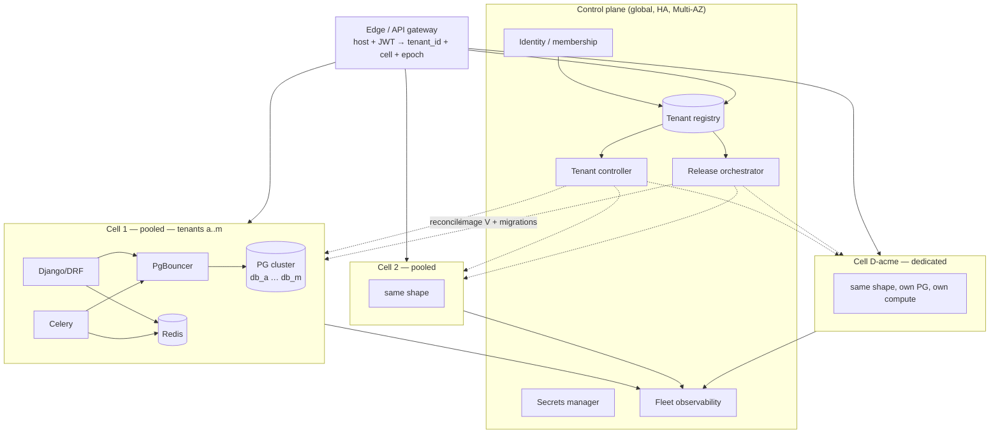
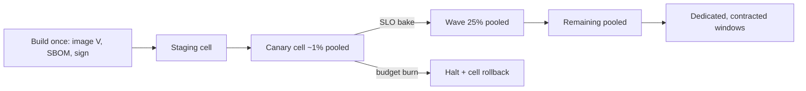
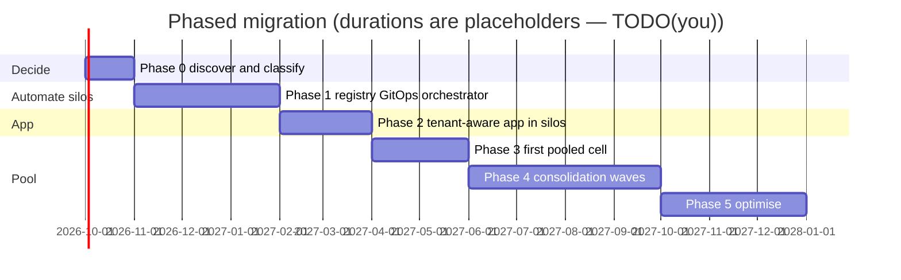
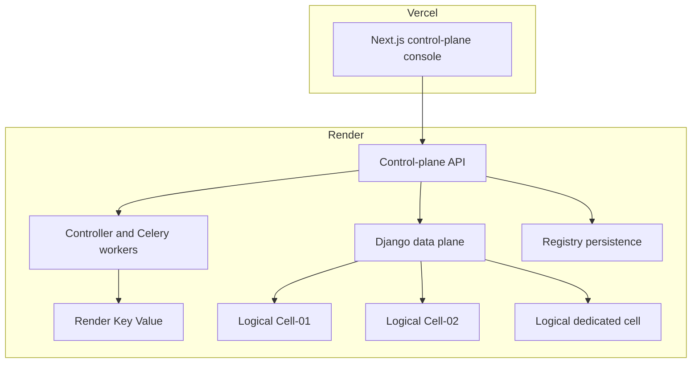

# plan.md — Re-architecting the platform for N tenants without O(N) operations

**Status:** architecture-review document. Mechanisms are specified as decisions, not implied.
**Owner:** you (Senior Backend Architect). Values marked `TODO(you)` cannot be invented without tenant inventory, contracts, and metrics.
**Reading list** (correct attributions — see Appendix C):

| Short name | Book |
|---|---|
| **DDIA** | *Designing Data-Intensive Applications* — Martin Kleppmann |
| **DBI** | *Database Internals* — Alex Petrov |
| **DS** | *Distributed Systems* — Maarten van Steen & Andrew S. Tanenbaum |
| **SRE** | *Site Reliability Engineering* — Beyer, Jones, Petoff, Murphy (eds.), Google |
| **DDS** | *Designing Distributed Systems* — Brendan Burns |

Each major decision carries a **confidence (0.0–1.0)**. Below 0.8: weakness and how to raise it.

---

## 0. How to read this plan

1. §1 is the success definition. If the KPIs are not falsifiable, the architecture is a preference, not a proposal.
2. §2–§4 are requirements, current state, and constraints. Do not skip the isolation classification.
3. §5 is the placement *policy*. Pooled / dedicated / sovereign are **outputs**, not the starting axiom.
4. §6 is the target topology. §7–§12 are the production-critical mechanisms a reviewer will attack.
5. §13–§18 are operations: DR, security, observability, cost, SLOs, failures.
6. §19–§22 are migration, runbooks, alternatives, and the decision record.
7. §23 is the complete portfolio implementation: repository, phase gates, UI, hosting, testing, and demo video.
8. Appendices map books to decisions and list `TODO(you)` work.

---

## 1. Business requirements and success metrics

### 1.1 The actual job

The brief implies a false choice: **separate environments (secure, unscalable)** vs **shared platform (scalable, less secure)**.

- **Isolation** is a *security property*: tenant A cannot read, write, or starve tenant B.
- **Separate environments** is an *operational topology*: N independently managed stacks.

The current design buys the property by paying for the topology. The job is:

> Keep (or improve) the isolation guarantee clients actually require, and make **tenant count irrelevant to operations**.

Every decision below is judged against that sentence.

### 1.2 What must be true after the change

| Requirement | Testable form |
|---|---|
| Isolation where required | No request, task, cache, or credential path can access another tenant's data. Proven by invariant tests (§6.1). |
| Fleet operations are O(waves), not O(N) | One artifact, one orchestrator, progressive cell waves. |
| Onboarding is a registry write | Controller provisions; humans do not run a per-tenant runbook. |
| Offboarding is complete and provable | Retention → purge → cryptographic/data deletion evidence. |
| Tenants can be moved | Whole-database rebalance with explicit cutover gates. |
| Failures are contained | Blast radius is a cell (or one tenant on dedicated), never the fleet. |
| Cost is justified | Cost/tenant at 100 / 500 / 1000 is better than silos at the same isolation tier. |

### 1.3 Success metrics (before → after)

These are the falsifiable outcomes. `TODO(you)` replace TODOs with measured baselines.

| Metric | Today | Target | How measured |
|---|---:|---:|---|
| Engineer effort per fleet release | TODO | **< 1 hour** human time (orchestration is automatic) | Time from “promote V” to last healthy wave, minus bake waits |
| Tenant onboarding (pooled) | Days | **< 15 min** to `active` | Registry `requested` → `active` |
| Configuration drift | N instances | **0** | GitOps drift detection; registry is sole source |
| Version skew | Multiple versions | **≤ 1** release behind `latest` | Registry `release` vs current artifact |
| Manual tenant deployment | N | **0** | No per-tenant deploy tickets |
| Tenant move cutover | N/A | **< 5 min** write-blocked window (size-independent if logical replication) | Controller timestamps |
| Tenant restore RTO (pooled, nightly dump) | TODO | **≤ 2 h** for one tenant | Restore drill |
| Cell restore RTO | TODO | **≤ 4 h** | Cell-loss drill |
| Cross-tenant incidents | ? | **0** | Postmortem class |
| Cell utilization (binding resource) | ? | **60–70%** at peak | Capacity model §11 |
| Cost / tenant (pooled, at 100 tenants) | TODO | **−40% to −70%** vs silo | Cost model §16 |
| Toil share of platform time | TODO | **< 30%** | SRE ch. 5, quarterly |

If phase 1 (automate silos) already hits the release and drift KPIs and growth is modest, **stop**. Cells are justified by onboarding time, unit cost, and growth — not by architectural fashion.

**Confidence in the KPI set: 0.9.** Confidence in the numeric targets: 0.6 until baselines exist.

---

## 2. Tenant classification

Nobody has written down **what isolation clients contractually or legally require**. “Concerns around data security” is not a requirement.

`TODO(you)`: classify every existing tenant.

| Class | Requirement (testable) | Typical placement output |
|---|---|---|
| **L0 Logical** | No query path can return another tenant’s rows | Eligible for shared schema *only* if count → thousands and contract allows. Not the default here. |
| **L1 Database** | Own database; per-tenant logical backup/restore; own DB role | **Pooled cell** (shared compute + shared PG cluster, own DB) |
| **L2 Compute + data** | No process holds another tenant’s credentials or data in memory | **Dedicated cell** |
| **L3 Network / account** | Own VPC / cloud account; own encryption keys (BYOK) | **Sovereign / dedicated-account** |
| **L4 Residency** | Region pinned | Placement constraint on any of the above |
| **L5 Audit** | SOC2 / ISO 27001 / sector evidence | Control-plane audit + tier-appropriate isolation |

The platform must **support every class**. Which class a tenant gets is a **placement-policy output** (§5), driven by contract, compliance, load, and price — not by a single architecture slogan.

Also classify load (used by §11):

| Size class | Definition (fill with real numbers) | Illustrative default |
|---|---|---|
| **S** | Steady API RPS + async QPS below pooled noise threshold | 5 RPS, 2 worker concurrency |
| **M** | Material share of a cell | 25 RPS, 8 worker concurrency |
| **L** | Can saturate a pooled cell if unbounded | 100 RPS, 32 worker concurrency |
| **XL** | Dedicated by load, regardless of contract | Measured; place dedicated |

`TODO(you)`: replace illustrative RPS with p95 peak from production.

---

## 3. Current architecture (as-is)



**Assumption (`TODO(you)` confirm):** one Django/DRF + PostgreSQL + Redis + Celery stack per tenant; containerised; probably one Kubernetes namespace or cluster per tenant; releases applied by hand or an untracked loop.

### 3.1 What it genuinely buys

| Property | Silo model delivers |
|---|---|
| Data isolation | Maximal — no shared catalog, buffer pool, or WAL |
| Blast radius | One tenant |
| Noisy neighbour | None |
| Per-tenant backup / PITR | Trivial (one cluster = one WAL stream) |
| Compliance story | Easy to explain |
| Application complexity | Minimal — tenant is implicit |

### 3.2 What it costs

Every operational activity is **O(N) human work** unless already automated:

| Activity | Cost today | Why it hurts |
|---|---|---|
| Release | N deployments | Version skew; “who is on 3.2?” is unanswerable |
| Schema migration | N × `manage.py migrate` | One bad data shape leaves the fleet inconsistent |
| Config change | N edits | Drift is guaranteed |
| Security patch | N × windows | Tail lag is a finding |
| Infra change | N × risk | Each is its own project |
| Monitoring | N dashboards | No fleet view |
| Cost | N × idle compute | Small tenants pay for a full stack at ~3% use |
| Onboarding | Days | Sales gated on ops |
| Offboarding | Ad hoc | Incomplete deletion; no proof |

**Toil model (SRE ch. 5):** fleet release cost = *N · t*. Toil that is manual, repetitive, automatable, and scales with service size is toil by definition. `TODO(you)`: plug in *t* and *N*.

### 3.3 What is not wrong

- The stack (Django/DRF/PostgreSQL/Redis/Celery) is correct. Do not rewrite it.
- Containers are the delivery unit.
- The silo as an *option* stays. The mistake is hand-managed, non-uniform silos as the *only* option.

### 3.4 Scorecard

| Dimension | Score (1–5) | Reasoning |
|---|---|---|
| Security / isolation | 5 | Physical separation |
| Reliability | 3 | Per-tenant blast radius good; fleet skew and patch lag bad |
| Scalability (tenants) | 1 | Linear ops; human-gated onboarding |
| Scalability (load per tenant) | 4 | Independent scale-out |
| Operational efficiency | 1 | Toil ∝ N |
| Cost efficiency | 2 | Idle capacity |
| Change velocity | 2 | Rare, large, risky releases |
| Application simplicity | 5 | Single-tenant code |
| Offboarding / deletion | 2 | Not a designed lifecycle |

**Verdict:** correct for ~5 tenants, wrong for ~50. The fix is not “make it multi-tenant”. The fix is “make tenant count irrelevant to operations”.

---

## 4. Constraints and assumptions

### 4.1 Constraints (do not violate)

1. Isolation requirements cannot be compromised for tenants who contractually have them.
2. One application codebase; no per-tenant forks.
3. PostgreSQL remains the system of record.
4. Existing silo tenants must be migratable without a rewrite.
5. Control-plane loss must not take down existing request traffic.
6. A failed tenant operation must not corrupt another tenant.
7. Filesystem is ephemeral in typical PaaS/K8s — tenant state lives in databases, object storage, and the registry, never on local disk.

### 4.2 Assumptions (replace with facts)

| Assumption | If wrong, what changes |
|---|---|
| Tens of tenants today; hundreds in 2–3 years | At thousands, default *output* of the placement policy may become shared-schema + RLS for the long tail (§5.3) |
| Load is skewed (few large, long tail small) | Placement and cell math in §11 |
| Current env ≈ full stack per tenant | Phase 1 cost |
| Releases are per-environment, weakly tracked | Toil baseline |
| Django is sync WSGI today; ASGI may arrive | Connection manager must be context-safe (§9.4) |

**Confidence the design holds from ~20 to ~1000 tenants at L1/L2: 0.8.**

---

## 5. Isolation decision: placement policy is the engine

Options on the spectrum (unchanged facts, different *use*):

| Option | Isolation | Blast radius | PITR | Ops / tenant | App complexity | When the policy emits it |
|---|---|---|---|---|---|---|
| **A. Shared schema + RLS** | Logical only | All in DB | Hard (rows interleaved; DBI ch. 3–4) | Lowest | Medium | Long-tail / free at **thousands** of tenants *and* contract is L0 |
| **B. Schema-per-tenant** | Catalog-separated | All in DB | Medium dump, no PITR | Low | Medium (`search_path` vs pooler) | Almost never — worst of both |
| **C. DB-per-tenant, shared PG cluster, pooled compute** | Strong: own DB + role | Cell / cluster | Logical easy; PITR cluster-wide | Low–medium | Medium (dynamic routing) | Default when class = **L1** and load = S/M |
| **D. Dedicated cell** (own compute, own PG cluster) | Physical | One tenant | Full per-tenant PITR | Medium $ | Same as C | Class **L2**, size **L/XL**, or contracted dedicated |
| **E. Dedicated cloud account / sovereign** | Account boundary | One tenant | Full | High $ | Same as C | Class **L3** / BYOK / customer account |

### 5.1 Decision engine (not “we selected C”)

```text
Isolation class (L0–L5)
        +
Tenant count & growth
        +
Tenant load distribution (S/M/L/XL)
        +
Compliance / residency
        +
Cost target / price charged
        ↓
Placement policy
        ↓
Pooled cell (C)  |  Dedicated cell (D)  |  Sovereign (E)
        [A only if L0 + thousands]
```

**Policy rules (v1):**

1. If contract or auditor requires L3 → **E**.
2. Else if contract requires L2, or size is L/XL, or client buys dedicated PITR → **D**.
3. Else if class is L1 (or L0 that still wants “own database” commercially) → **C**.
4. Else if class is L0 **and** fleet is thousands of tiny tenants **and** legal accepts it → **A** for that segment only.
5. Never emit **B** as a default.
6. Re-evaluate on contract change, sustained saturation, or noisy-neighbour incidents.

**Same artifact. Same control plane. Same migration runner.** If a tier requires a different application code path, the design has failed.

### 5.2 Why C is the usual *output*, not the axiom

1. Clients already understand “your own database”. C preserves that sentence.
2. A turns one application bug into a cross-tenant breach (`BYPASSRLS`, pooler role mix-up).
3. B still costs N migrations, has no PITR, and fights PgBouncer `search_path`.
4. C makes the tenant the movable partition (DDIA ch. 6).
5. D/E exist so “we need our own servers” is a SKU, not a “no”.

**Confidence: 0.8** that C is the correct *default output* for this brief. Weakness: unknown growth and contracts. The policy exists so those facts change the output without rewriting the platform.

### 5.3 Known weaknesses of C (disclose them)

- **PITR is cluster-wide.** “Restore my data to 10:42” = restore cluster to scratch, extract DB. Minutes-to-hours. Buy D for fast PITR.
- **A compromised app pod can reach every tenant DB in that cell.** Mitigations in §14; residual is accepted and priced.
- **Hundreds of DBs per cluster is comfortable; thousands is not** (autovacuum, backup windows, pooler cardinality). Split clusters; or flip long-tail default to A if growth demands it.

---

## 6. Target architecture

### 6.1 Architecture invariants (testable properties)

These are stronger than principles because CI, chaos tests, and audits can fail them.

| ID | Invariant | Test |
|---|---|---|
| **I1** | A request without tenant identity can never access tenant data | Missing/mismatched tenant → 4xx; no `default` DB query for tenant data |
| **I2** | A tenant DB credential authenticates only to that tenant DB | `REVOKE CONNECT … FROM PUBLIC`; role has `CONNECT` on one DB |
| **I3** | A cell cannot access another cell’s tenant databases or Redis | NetworkPolicy / SG tests; secret-path policy tests |
| **I4** | Every asynchronous task carries a signed tenant identity | Worker refuses unsigned/mismatched envelope |
| **I5** | Every production tenant is represented in the registry | Controller alert: orphan DB or orphan ingress |
| **I6** | No production tenant exists outside the control plane | Same; bootstrap recovery (§18.4) re-imports or quarantines |
| **I7** | Every release is reproducible from one immutable artifact | Image digest identical across cells; SBOM attached |
| **I8** | A failed tenant migration/move cannot corrupt another tenant | Advisory lock + per-tenant credentials + no shared-schema writes |
| **I9** | Cache keys for tenant data include `tenant_id` + `tenant_version` | Backend rejects unprefixed keys; move increments version |
| **I10** | Support/debug access is time-limited, tenant-scoped, and audited | Break-glass tickets; no standing superuser on app pods |

### 6.2 Principles (each kills a §3.2 pain)

| Principle | Kills | Source |
|---|---|---|
| Control plane / data plane split | Drift, “which version”, human onboarding | DDS operator; SRE ch. 7 |
| Cells = deploy, capacity, and failure unit | Unbounded blast radius | DDIA ch. 6; DDS shards; DS containment |
| One artifact, never rebuilt per tenant | Version skew | SRE ch. 8 |
| Tenant context mandatory and propagated | Cross-tenant leaks | DS ch. 9; DDIA ch. 8 |
| Desired state, reconciled | Half-provisioned tenants | DDS; DDIA ch. 8 |
| Expand/contract migrations | One bad tenant blocks the fleet | DDIA ch. 4 |
| Placement policy, not a frozen topology | Wrong default as facts change | §5 |

### 6.3 Topology



**Confidence in topology: 0.85.** This is the shape Shopify pods / Salesforce instances / AWS SaaS guidance converge on.

### 6.4 Control-plane components

| Component | Responsibility | Non-goals |
|---|---|---|
| **Tenant registry** | SoT: `tenant_id`, slug/host, placement (tier, cell, region), DB DSN *reference*, `schema_version`, `tenant_version` (epoch), flags, lifecycle status, legal hold | Never holds tenant business data |
| **Identity service** | Users, membership, roles, impersonation tickets, service identities (§7) | Not the IdP UI for end customers if you already have one — it *consumes* it |
| **Tenant controller** | Reconciles lifecycle: provision, migrate, move, suspend, delete. Idempotent steps, progress recorded | No business logic |
| **Release orchestrator** | Promotes image V; waves; migration runner; resume-from-desired-state after crash (§15.5) | Does not build images |
| **Migration runner** | Per-tenant `pg_advisory_lock`, migrate, record version. Bounded concurrency. Failed tenant → `degraded`, not fleet halt | No contract migrations in the expand release |
| **Edge routing** | `host → tenant_id → cell` + epoch; inject `X-Tenant-Id` + `X-Tenant-Version`; JWT must match | Not a business API |
| **Secrets** | Per-tenant DB creds; per-cell Redis; cell can only read its tenants | — |
| **Observability** | `tenant_id`, `cell_id`, `tier`, `release`, `tenant_version` with cardinality rules (§15) | — |

Registry failure mode (mandatory): **no new tenants / no moves / no routing updates**. Existing traffic is served from edge cache (stale-on-error). Never “no traffic”.

### 6.5 Cell anatomy

- **Compute:** Django/DRF HPA; Celery + KEDA/queue depth. Stateless. No tenant config baked into images.
- **PgBouncer:** mandatory. Transaction pooling. **One pool per (database, user)**. Per-tenant cap + cell-wide cap. PostgreSQL forks a process per connection (DBI ch. 1).
- **PostgreSQL:** primary + replica; many DBs per cluster. Start one cluster per cell; split on the first ceiling in §11. Per-tenant role; `REVOKE CONNECT ON DATABASE … FROM PUBLIC`.
- **Redis:** one per cell. Keys: `t:{tenant_id}:{tenant_version}:` enforced in a cache backend.
- **Object storage:** per-tenant prefix + IAM condition (pooled); per-tenant bucket + KMS (dedicated).
- **Broker:** one per cell. Not one per tenant.

---

## 7. Identity and authorization

The old sketch `Host → tenant_id → JWT check → X-Tenant-Id → app` is directionally right and **incomplete**. It does not say who may *claim* a tenant.

### 7.1 Authoritative identities

| Identity | Authority | Notes |
|---|---|---|
| **`tenant_id`** | Registry UUID (immutable). Slug/hostname are aliases. | Hostnames can change; IDs cannot. |
| **Human user** | Customer IdP (SSO) or platform IdP. Subject = `user_id`. | Users are *not* tenants. |
| **Membership** | Registry table `membership(user_id, tenant_id, role, status, expires_at)` | Source of “this user may act as this tenant”. |
| **Service identity** | Platform-issued mTLS or signed JWT (`iss=control-plane`, `aud=cell`, `tenant_id` optional) | Workers, controllers, migration jobs. |
| **Support identity** | Break-glass ticket (§14.4) | Never a standing “all tenants” app role. |

**Authoritative tenant identity for data access = registry `tenant_id`.** JWT `tenant` claim is an *assertion* that must match host resolution **and** membership (for user traffic).

### 7.2 Membership and multi-tenant users

```text
User authenticates (IdP)
        ↓
Session / access token contains user_id only
        ↓
Edge resolves host → tenant_id
        ↓
Authorization: membership(user_id, tenant_id) is active
        ↓
Edge mints request context:
  X-Tenant-Id, X-Tenant-Version, X-Actor-Id, X-Actor-Type
        ↓
App binds contextvar; fail closed if any required field missing
```

- A user may belong to many tenants. Switching tenant = switch host or explicit tenant picker that issues a new tenant-bound token.
- **Removing a user from a tenant:** membership `status=revoked`, tokens with that tenant audience are denied at the edge (short JWT TTL, e.g. 15 min, plus denylist for the remainder of TTL). Sessions are not global-logout of other tenants.
- **Admin impersonation:** only via break-glass (§14.4). A platform admin JWT cannot set an arbitrary `tenant` claim. Impersonation tokens are minted by the identity service after approval, scoped to one `tenant_id`, TTL measured in hours, audited.

### 7.3 What prevents forging a tenant claim

1. External `X-Tenant-Id` / `X-Tenant-Version` are **stripped** at the edge. Only the edge writes them.
2. User JWT is signed by the IdP; app pods verify signature and `iss`/`aud`. App pods do **not** trust an unsigned `tenant` field.
3. Edge checks: `resolve(host).tenant_id == jwt.tenant_id` (if the access token is tenant-bound) **or** membership lookup if the token is user-bound.
4. Tenant-bound access tokens include `tenant_id` as a signed claim; changing it invalidates the signature.
5. Service-to-service: cell mesh mTLS; tokens have `aud=cell_id` and cannot be replayed to another cell.
6. Database credentials cannot be swapped in the app to “try another tenant”: the router only loads DSNs for the bound `tenant_id`, fetched from cell-scoped secrets.

### 7.4 Service-to-service

| Caller | Callee | Auth |
|---|---|---|
| Edge → app | mTLS + injected tenant headers |
| App → secrets | Workload identity; path `cells/{cell_id}/tenants/{tenant_id}/*` |
| Controller → PG (provision) | Control-plane role (CREATE DATABASE), not app role |
| Worker → PG | Same per-tenant role as app, via same router |
| Cell A → Cell B | **Denied** by network policy |

### 7.5 Debug / support users

See §14.4. Support is not “a superuser JWT”. It is an approved, tenant-scoped, time-limited credential.

**Confidence: 0.85.** Weakness: existing IdP/session model is unknown. Raise by mapping current auth to membership in phase 0.

---

## 8. Tenant lifecycle

Statuses in the registry are not labels. They are a **state machine** the controller reconciles.

### 8.1 Provisioning

```text
requested
   ↓
provisioning
   ↓
database_ready          CREATE DATABASE + ROLE + REVOKE CONNECT FROM PUBLIC
   ↓
schema_ready            baseline migrations at current fleet expand schema
   ↓
secrets_ready           DSN reference + secret material; cell policy bound
   ↓
routing_ready           host/JWT mapping published; edge cache wait
   ↓
active
```

Each step is idempotent, writes `lifecycle_step` + timestamp, and is safe to retry. The controller never “starts over” from `requested` if `database_ready` already happened.

### 8.2 Provisioning failure

```text
provisioning / any step
    ↓
failed
    ↓
automatic retry (bounded, exponential)
    ↓
failed_terminal  → operator runbook (§20)
    ↓
rollback: drop incomplete DB/role/secret/DNS if never active
```

A tenant that never reached `active` may be hard-deleted immediately. A tenant that was `active` follows offboarding, not rollback.

### 8.3 Move

```text
active
  → migrating_setup      dest DB + publication/subscription
  → migrating_catchup    lag > 0
  → migrating_quiesce    writes blocked; tasks paused
  → migrating_validate   lag=0, tx=0, sequences, checksums, health
  → cutover              registry cell + epoch++; edge invalidate
  → active
```

Failure: stay on source if cutover not committed; see §12.3 for split-brain rules.

### 8.4 Suspension, hold, deletion (offboarding)

```text
active
  → suspended            auth denied; tasks cancelled/nacked; cron skipped
  → retention_hold       data retained; no login; legal hold optional
  → deleting             ordered purge
  → deleted              tombstone remains in registry (id reserved)
```

Legal hold **blocks** `deleting`. `TODO(you)`: retention days (illustrative: 30–90).

### 8.5 Offboarding checklist (mandatory)

| Step | Action | Proof |
|---|---|---|
| 1 | Set `suspended`; deny auth; stop beat for tenant | Audit event |
| 2 | Drain/cancel queued tasks; DLQ snapshot if needed for disputes | Queue empty metric |
| 3 | Wait retention / legal hold | Calendar + hold flag |
| 4 | Revoke DB role; rotate then delete secret | Secrets audit |
| 5 | Drop tenant DB after final logical dump to cold storage (if contract) | Backup object + checksum |
| 6 | Delete object-storage prefix/bucket (versioned delete + lifecycle) | Inventory zero |
| 7 | Flush Redis keys `t:{id}:*` | SCAN/unlink complete |
| 8 | Remove DNS / host mapping; increment epoch | Edge miss |
| 9 | Remove memberships; revoke refresh tokens | IdP / membership |
| 10 | Keep **audit** events for compliance retention (`TODO(you)` years) | Separate store |
| 11 | Issue **certificate of deletion** (what was deleted, when, what was retained for law) | Control-plane artifact |

Incomplete offboarding is a security incident class, not a chore.

**Confidence in the state machine: 0.88.** Durations and legal retention are `TODO(you)`.

---

## 9. Data and tenant-aware connection management

This is the **highest implementation risk**. Treat it as a productized module, not a router snippet.

### 9.1 Database compatibility matrix (move + restore)

A tenant move or PITR extract fails if source and dest are not compatible. Gate every cluster pair:

| Object / property | Policy |
|---|---|
| PostgreSQL major version | Dest ≥ source; dest in supported matrix. No silent major downgrade. |
| Extensions | Allow-list per cell (`uuid-ossp`, `pg_trgm`, `citext`, …). Move blocked if dest missing. |
| Custom types / enums | Must exist in dest template DB before subscription. |
| Functions / triggers | Included in initial schema apply; logical replication does not replay CREATE FUNCTION. |
| Sequences | **Not** replicated by logical replication — explicit `setval` at cutover. |
| Identity columns | Prefer over serial if starting fresh; still verify. |
| Large objects | Logical replication does **not** carry them. Inventory; dedicated copy or forbid LOBs. |
| Collations | Same ICU/glibc collation on both clusters (Linux case-sensitivity + collation matter). |
| Generated columns | Schema-applied, not replicated as data. |
| FDW | Forbidden on tenant DBs unless dedicated-tier exception. |
| pg_cron / session GUCs | Per-database settings captured and reapplied. |
| Encoding | `UTF8` only. |

**Compatibility check is a controller preflight.** Fail `migrating_setup`, do not start copy.

### 9.2 Connection creation and reuse

```text
Request/task binds tenant_id
        ↓
Router.resolve(tenant_id)
        ↓
If alias missing or epoch stale:
    fetch DSN from secrets (cell-scoped)
    register connections.databases[alias]
        ↓
Checkout connection from Django / pool
        ↓
PgBouncer pool (db_t, role_t)
        ↓
On return: assert current_database() == expected
        ↓
Never return a connection to a generic pool that another tenant can inherit
```

Rules:

1. Alias name = `t_{tenant_id}` (immutable id, not slug).
2. **`default` never holds tenant data.** It is unused or a tiny cell metadata DB with no tenant rows.
3. Connections are created lazily on first use in that process.
4. **Max aliases cached per worker:** `min(tenants_in_cell, MAX_ALIASES)` e.g. 64. LRU eviction **closes** the underlying connection before dropping the alias.
5. Evict on: LRU, `tenant_version` change, credential rotation version change, idle TTL (e.g. 15 min), worker shutdown.
6. After tenant **move**: `tenant_version++` (and cell change) invalidates every cached DSN. Old connections must not be reused — check version on every checkout.
7. After **credential rotation**: secret version in registry; workers evict that alias; in-flight tx finish; new checkout uses new secret. Overlap window: both secrets valid for ≤ 1 hour.
8. **Reuse** is only allowed when `(process, tenant_id, tenant_version, secret_version)` all match.
9. **Wrong-tenant reuse prevention:** thread-local / contextvar bind; connection wrapper stores `bound_tenant_id`; returning a connection to Django’s pool with a different tenant is a fatal assert. Do not use a process-global “current tenant” without contextvars.
10. **ASGI / async:** one request = one context. Never share a connection across tasks. If using async ORM, disable thread-shared connections; pin the module’s contract in tests.
11. **Transactions:** a transaction cannot change tenant mid-flight. `atomic()` uses the already-bound alias. Cross-tenant transactions are forbidden (there is no distributed TX across tenant DBs).
12. **Migrations:** `manage.py migrate --database=t_{id}` only, invoked by the runner with cell credentials. Local `migrate` against `default` is CI-blocked.
13. **Third-party packages:** allow-list. Anything that hard-codes `default` is wrapped or rejected. Admin, `dumpdata`, and django-debug-toolbar are known footguns — wrap management commands.
14. **Read replicas (later):** extra aliases `t_{id}_ro` selected by router for annotated read-only views. Replica lag SLO required before enabling. Writes always primary. Do not add replicas until measured (§11).

### 9.3 Request path

```mermaid
sequenceDiagram
    participant U as Client
    participant E as Edge
    participant R as Registry cache
    participant A as Django pod
    participant PB as PgBouncer
    participant DB as db_tenant

    U->>E: HTTPS + user JWT
    E->>R: host + membership
    R-->>E: tenant_id, cell, tenant_version
    E->>E: strip inbound X-Tenant-*; assert membership
    E->>A: request + tenant headers
    A->>A: contextvar bind; refuse default DB
    A->>A: checkout connection matching version
    A->>PB: pool (db_t, role_t)
    PB->>DB: query (DB is the tenant)
    A->>A: assert current_database
    A-->>U: response
```

**Confidence in connection design: 0.75.** Raise to ≥ 0.85 only after a 50-tenant synthetic cell prototype (phase 2 exit). Budget two weeks of edge cases.

---

## 10. Async architecture (Celery)

The synchronous path can be tight while the queue is the leak. Treat the task envelope as a security boundary.

### 10.1 Path

```text
Producer (request or beat)
   ↓
bind tenant_id from contextvar (beat: explicit per-tenant fan-out)
   ↓
signed task envelope {tenant_id, tenant_version, idempotency_key, schema_v, payload_v}
   ↓
broker (per cell)
   ↓
worker verifies signature + tenant still active
   ↓
bind contextvar; checkout tenant DB
   ↓
execute idempotently
   ↓
ack
```

Unsigned, missing-tenant, or version-skewed (payload newer than worker) tasks are **rejected** to a poison/DLQ, not executed.

### 10.2 Mandatory cases

| Case | Policy |
|---|---|
| Retry | Same envelope; same `idempotency_key`; at-least-once. Handlers must be idempotent. |
| Delayed / ETA | Envelope stored with task; re-verify tenant `active` at start. |
| Replay | Signature + idempotency store (`t:{id}:{ver}:idemp:{key}`, TTL ≥ max retry window). |
| DLQ | After N failures: DLQ + tenant alert; do not block other tenants. |
| Poison message | Unreadable/unsigned → DLQ immediately; increment security metric. |
| Duplicate execution | Idempotency key wins; second run no-ops. |
| Cancellation | Registry `cancel_generation` or task-id revoke **and** worker checks generation after dequeue. |
| Tenant `suspended` | Worker nacks without retry-to-main; optional DLQ for later resume. |
| Tenant `deleting` / `deleted` | Drop (ack) after snapshot if required; never write to a dropping DB. |
| Beat | No global “run for all” without tenant iteration from registry. One task per tenant. |
| Concurrency | Per-tenant cap + size-class queues so one tenant cannot starve the cell. |

Payload compatibility: **workers at image V must accept payload_v V-1** until the compatibility window expires (§15.4).

**Confidence: 0.82.** Weakness: current Celery routing/beat layout unknown.

---

## 11. Cell capacity model

“100–300 tenants” and “~70% IOPS” are not a model. Capacity is the **minimum** of binding resources.

### 11.1 Binding formula

```text
usable(resource) = hard_limit × 0.70     # headroom for spikes, vacuum, deploys

cell_capacity_tenants = min over resources of:
    usable(resource) / sum(expected_peak(tenant) for tenants placed)

Resources:
  PG max_connections (after superuser + replica + admin reserve)
  PG CPU, memory, shared_buffers
  Storage IOPS and WAL throughput
  Disk growth (data + WAL + bloat)
  Redis memory
  Celery throughput (tasks/s)
  App CPU/memory (usually not first to bind)
  PgBouncer process/pool count
  Database-count ceiling (autovacuum, backup duration)
```

### 11.2 Illustrative tenant load (replace)

| Class | API RPS peak | DB conns peak | Worker concurrency | Redis MB | Disk GB |
|---|---:|---:|---:|---:|---:|
| S | 5 | 4 | 2 | 20 | 5 |
| M | 25 | 12 | 8 | 80 | 25 |
| L | 100 | 40 | 32 | 300 | 150 |

### 11.3 Illustrative cell (one PG primary, example hardware)

Assume `TODO(you)` hardware. Example only:

```text
PG max_connections = 400
reserve = 40
usable_conns = (400 - 40) × 0.70 = 252

Mix A (long tail): 80% S, 18% M, 2% L
  weighted_conns ≈ 0.8×4 + 0.18×12 + 0.02×40 = 6.24
  tenant_cap_by_conn ≈ 252 / 6.24 ≈ 40

That cell is connection-bound near ~40 tenants, not 300,
unless PgBouncer transaction pooling collapses app-side
churn so PG sees far fewer backends (the usual case).

After pooler, backends ≈ sum(tenant_pool_cap) with
tenant_pool_cap S=2, M=5, L=15 → weighted ≈ 2.8
  tenant_cap_by_conn ≈ 252 / 2.8 ≈ 90
```

Then take `min` with IOPS, WAL, Redis, and **database-count** (start cap: **75–150 databases per cluster**, split cluster before 200). **100–300 tenants per cell is a target only if the mix is mostly S and the pooler is in place.** A cell of M/L tenants is much smaller. **Max 2 L tenants per pooled cell**; XL → dedicated.

Placement: most headroom, not round-robin; size-class caps; move when a tenant’s peak exceeds its class for 7 days.

**Confidence in the formula: 0.9. Confidence in the example numbers: 0.45.** Fill from metrics before promising density.

---

## 12. Tenant move — consistency, not optimism

Downtime of “seconds to low minutes, independent of size” is **true only if** logical replication is caught up, writes are quiesced, and validation passes. It is not a property of “we use logical replication”.

### 12.1 Cutover gates (all must pass)

```text
replication lag = 0          (confirmed flush LSN)
active transactions = 0      on source tenant DB
write traffic blocked        edge 503 + Retry-After; Celery paused
sequence state synchronized  setval from source
row validation passed        counts + checksum sample / expected
compatibility preflight      §9.1
application health check     dest cell can open role_t and run /ready
routing epoch incremented    tenant_version++  (this is the commit)
traffic switched             registry cell_id + edge invalidate
source retained read-only    T hours (TODO: 24–72) then drop
```

DDL is frozen for that tenant from `migrating_setup` to `active`.

### 12.2 Split-brain and partial failure

| Failure | Rule |
|---|---|
| Cutover gates fail | Abort; keep source `active`; drop dest after debug snapshot |
| Registry update fails after dest is ready | **Source remains authoritative.** Dest is warm standby. Retry registry. Do not serve dest. |
| Registry updates, edge cache stale | Dual-publish: dest accepts; source is read-only. Writes on source are rejected. Clients retry. TTL short (e.g. 10–30s) + explicit invalidation + `tenant_version` in responses |
| Controller crash mid-move | Resume from recorded step; never restart initial copy if subscription exists |
| Validation mismatch | Abort to source; incident |

**Commit point** = registry write `{cell_id, tenant_version}` in one transaction. Everything before is reversible. Everything after is “repair dest or roll back by flipping registry to source within retention”.

**Confidence: 0.8.** Raise by rehearsing the largest tenant copy before phase 3.

---

## 13. Backup and disaster recovery

### 13.1 What exists

| Layer | Mechanism | RPO (target) | RTO (target) |
|---|---|---|---|
| PG cluster | WAL archive + base backup (pgBackRest/WAL-G) | ≤ 5 min pooled | Cell restore ≤ 4 h |
| Tenant | Nightly logical dump, encrypted, per-tenant prefix | ≤ 24 h | Single-tenant restore ≤ 2 h |
| Dedicated PITR | Cluster WAL is that tenant | ≈ 0 with sync replica | Tenant PITR ≤ 1 h |
| Registry | Multi-AZ + PITR | ≤ 1 min | ≤ 15 min |
| Object storage | Versioning + cross-region optional | Product-defined | Prefix restore |

Pooled “PITR to 10:42” = cluster scratch restore + extract. **Disclose this.**

### 13.2 Restore testing (backup ≠ works)

| Cadence | Drill | Pass criteria |
|---|---|---|
| **Monthly** | Restore one random tenant DB to scratch; app smoke | RPO met; checksum 100%; login + write path |
| **Quarterly** | Restore one full cell from WAL + dumps | RTO ≤ cell target; registry re-point; no cross-tenant mix |
| **Semi-annually** | Simulate cell or region loss | Runbook time ≤ target; invariants I5–I6 hold |

A missed drill is an error-budget event for the platform team.

---

## 14. Security and threat model

### 14.1 Isolation comparison (honest)

| Threat | Silo today | Pooled | Dedicated |
|---|---|---|---|
| App bug returns other tenant’s rows | Impossible | Needs routing bug **and** wrong DB — I1/I2 + query-alias test | Impossible |
| Compromised app pod | One tenant | **All tenants in the cell** | One tenant |
| Compromised DB host | One tenant | All DBs on cluster | One tenant |
| Queue replay wrong tenant | N/A | Signed envelope + I4 | Same |
| Cache cross-read | N/A | Prefix + epoch (I9) | N/A |

Say out loud: pooled is weaker on compromised infrastructure. Dedicated is the paid removal of that residual.

### 14.2 Attack scenarios — prevent / detect / respond

| Scenario | Prevent | Detect | Respond |
|---|---|---|---|
| Compromised app pod | Cell-scoped secrets; no cluster superuser; NetworkPolicy | Unexpected secret reads; `current_database` mismatch metrics; process anomaly | Rotate all tenant creds in cell; isolate node; optional tenant moves |
| Compromised worker | Same + signed tasks | Task tenant ≠ connection tenant | Drain workers; revoke broker creds |
| Stolen service token | Short TTL; `aud=cell`; mTLS | AuthZ denials; token use from wrong IP/cell | Revoke; rotate mesh |
| Stolen tenant DB creds | Role per DB; `pg_hba` cell-only; rotation | Connections from unexpected source | Rotate role password; kill sessions |
| Malicious tenant admin | AuthZ in-app; audit | Burst export / mass delete | Suspend actor; legal hold |
| Support engineer abuse | Break-glass only; no standing power | Every session audited | Revoke; HR/security process |
| Registry compromise | HA + tight IAM; no tenant data there | Impossible routing changes | Freeze routing; restore registry PITR; re-verify I5/I6 |
| Secrets-manager compromise | Split control vs data IAM; no long-lived static files | Burst get-secret | Rotate cell; consider dedicated for high-sensitivity |
| Supply-chain image | One build, SBOM, sign, admit only signed | Admission controller reject | Rollback artifact; re-deploy last good digest |
| DB superuser compromise | Superuser only on break-glass jump host | Superuser connections alert | Incident; possible cluster rebuild |
| Cross-cell network escape | Default-deny NetworkPolicy | Unexpected east-west flows | Isolate cell; patch CNI/policy |

### 14.3 Layered enforcement

1. Edge: host + membership + strip headers.
2. App: contextvar, router, fail-closed, post-request `current_database` assert.
3. Secrets: fetch-on-use, TTL, cell path policy, rotate on move.
4. DB: one role, one DB; no superuser from pods.
5. Cache/queue: prefix + epoch; signed tasks; broker per cell.
6. Storage: prefix IAM or per-tenant bucket + KMS.
7. Audit: immutable events for provision, move, secret read, migrate, break-glass, delete.
8. Network: cell A cannot reach cell B data stores.

`TODO(you)`: map SOC2/ISO controls onto this list. If an auditor rejects pooled language, that tenant is D or E. Do not argue; price it.

### 14.4 Break-glass / support access

```text
Support request (ticket + tenant_id + reason + duration)
   ↓
Approval (two-party for production data)
   ↓
Identity service mints time-limited credential
   scoped to one tenant_id, no other cell secrets
   ↓
Session fully audited (queries optional via pgaudit)
   ↓
Automatic expiry; no renewal without new approval
```

Platform engineers do not hold standing client-data credentials. Controller/admin roles create databases; they do not `SELECT` tenant business tables in normal operation.

---

## 15. Observability, releases, and compatibility

### 15.1 Cardinality and retention

| Signal | Labels | Policy |
|---|---|---|
| Metrics (histograms) | `cell_id`, `tier`, `release`, `route_group` | **No `tenant_id` on histograms** |
| Metrics (counters) | + `tenant_id` only on low-cardinality events (authz fail, cross-tenant assert) | Cap or hash if N → thousands |
| Logs | `tenant_id`, `cell_id`, `release`, `trace_id`, `actor_id` | Retention `TODO` (e.g. 30–90 d) |
| Traces | Same + sample | Default 1–5%; errors 100%; tenant debug boost via flag |
| Audit | Control-plane actions | Years, separate store |
| Correlation | `trace_id` on request, task, and DB `application_name` | Mandatory |

Alert ownership: **cell/platform** on-call owns pages. Tenant SLO burn that is not a cell event is a ticket, not a page, unless dedicated-tier contract says otherwise. Deduplicate by `alertname + cell_id`. Fleet thresholds ≠ per-tenant thresholds (a 1% error rate on a 10-RPS tenant is not a cell incident).

### 15.2 Release pipeline



- Dedicated last, **never more than one release behind**.
- Release cost = O(waves), constant in N.

### 15.3 Schema migrations and the “bad tenant” path

Non-negotiable: expand/contract; app V works on schema V-1 and V; backfills are jobs; lint destructive ops in CI; bounded parallelism per cluster.

```text
Migration failed on tenant X
    ↓
tenant.schema_status = degraded
    ↓
excluded from next wave automatically
    ↓
bounded automatic retry
    ↓
page/ticket: runbook owner
    ↓
fix data or hotfix migration; do not block healthy tenants
```

A degraded tenant is a **tenant incident**, not a release incident — unless the failure rate exceeds a wave threshold (e.g. >2% of the wave), which **does** halt the wave (systematic bug).

### 15.4 API / event compatibility

While cells can be one release apart:

| Channel | Rule |
|---|---|
| HTTP API | Additive changes in V; removals only after all cells + supported clients pass window |
| Mobile/web | Advertise `min_client_version`; breaking API only after that is enforced |
| Webhooks | Versioned payload (`payload_v`); consumers on v-1 until expiry |
| Celery | Workers V accept payload V-1 |
| Domain events | Schema registry or explicit version field; no silent rename |

**API V must accept V-1 task/event payloads until the migration window expires.**

### 15.5 Orchestrator crash (reconcile, do not restart blindly)

Example: cells 1–2 on V5, cells 3–4 on V4, orchestrator dies.

On start:

1. Read desired `fleet_release = V5` and per-cell `actual_release`.
2. Resume the current wave; do not re-canary if canary already passed.
3. Never skip health gates.
4. If a cell is mid-migration, tenant runner resumes per-tenant `schema_version` (same as provision).

The orchestrator is a reconciler. Desired vs actual is in the registry.

---

## 16. Cost model

Business justification: **same isolation class where required + lower ops cost + faster onboarding.**

### 16.1 Shape

```text
Current (silo):
  N × (app compute + Redis + PostgreSQL + workers + monitoring + backups + human ops)

Target:
  cells × shared (app + Redis + broker + PG cluster + monitoring)
  + Σ tenant DB storage
  + Σ tenant backups
  + Σ tenant secrets
  + control plane (fixed)
  + dedicated/sovereign extras
```

### 16.2 Illustrative unit economics (`TODO(you)` replace $)

Let:

- `S` = fully loaded monthly cost of one silo stack (compute+PG+Redis+obs)
- `C_cell` = monthly cost of one pooled cell (shared stack + one PG cluster)
- `c_db` = marginal monthly cost of one tenant DB (storage + backup + extra IOPS)
- `H` = monthly human ops cost / tenant today
- `H'` = monthly human ops cost / tenant after (≈ 0 for routine work)

```text
cost_silo(N)     = N × (S + H)
cost_pooled(N)   = ceil(N / tenants_per_cell) × C_cell + N × c_db + H'×N + CP
cost_per_tenant  = cost / N
```

**Worked example (not a quote):** if `S = 400`, `C_cell = 2500`, `c_db = 15`, `tenants_per_cell = 80`, `H = 80`, `H' = 8`, `CP = 1500`:

| N | Silo $/mo | Pooled $/mo | $/tenant silo | $/tenant pooled |
|---:|---:|---:|---:|---:|
| 20 | 9,600 | 5,660 | 480 | 283 |
| 100 | 48,000 | 10,050 | 480 | 101 |
| 500 | 240,000 | 32,750 | 480 | 66 |
| 1000 | 480,000 | 61,000 | 480 | 61 |

Dedicated tenants stay near silo **infrastructure** cost but drop **H** because they are fleet-managed. The savings story for D is operations, not idle compute.

**Confidence in the algebra: 0.9. Confidence in the dollars: 0.3.** Put real invoices in the table before a steering review.

---

## 17. SLOs

Define per tier, measured per tenant, rolled up per cell. Examples — `TODO(you)` set real numbers.

| SLI | Pooled | Dedicated |
|---|---|---|
| API availability (non-5xx) | 99.9% / 30d | 99.95% |
| API latency p99 | TODO ms | TODO ms |
| Enqueue → start p95 | TODO s | TODO s |
| Release skew | ≤ 1 release from latest | same + window |
| Durability | RPO ≤ 5 min WAL; tenant dump 24 h | RPO ≈ 0; tenant PITR |
| Move cutover write-block | ≤ 5 min | ≤ 5 min |
| Restore (drill) | Tenant ≤ 2 h; cell ≤ 4 h | Tenant PITR ≤ 1 h |

Error budgets gate waves (§15.2) and make tiers sellable.

---

## 18. Failure scenarios and shared-infrastructure semantics

A cell architecture works only if **shared dependencies respect the cell boundary**.

| Dependency | Blast radius | Fallback | RTO | Data-loss risk | Customer impact |
|---|---|---|---|---|---|
| PostgreSQL primary | Tenants on that cluster | Replica promote | minutes | RPO of replica | Writes down |
| Redis | Cell cache + possible broker if colocated | Serve uncached; if broker, pause workers | minutes–hour | Cache yes; broker depends on durability | Slower API; async delay |
| Celery broker | Cell async | Buffer producers; DLQ after | minutes–hour | Unacked tasks replay | Jobs late |
| Secrets manager | New connections / rotations fail | In-process secret cache TTL (e.g. 15–60 min) | depends | none if cache warm | New tenants + rotates fail first |
| DNS | Hosts that depend on it | Low TTL + Anycast; keep old records during moves | minutes | none | Login/API miss |
| Ingress / edge | Region or VIP | Multi-AZ edge; stale registry cache | minutes | none | 5xx / 503 |
| Object storage | Attachments / dumps | Retry; read-only features | vendor | if region loss | Uploads fail |
| Container registry | New deploys / scale-from-zero | Mirror; don’t evict running images | hours for *new* pods | none | Scale-out blocked |
| Observability | Blind on-call | Local scrape buffer; do not block requests | hours | telemetry | Hidden incidents |
| Registry | Changes only | Stale-on-error routes | 15 min restore | routing metadata | No onboard/move |

**Control-plane HA (registry):**

- Multi-AZ primary + sync or fast-failover replica.
- PITR; RPO ≤ 1 min; RTO ≤ 15 min.
- Edge cache TTL 10–30s; stale-on-error for ≥ 15 min.
- Cache invalidation: version/epoch push + TTL. Split-brain: registry is SoT; two writers forbidden (single primary).
- **If registry unavailable during a tenant move:** freeze at last recorded step; do not flip traffic; source stays live if commit point not reached.

### 18.4 Control-plane bootstrap from zero

Scenario: Kubernetes is alive, cells exist, secrets exist, **registry is gone**.

```text
1. Restore registry from PITR/backup. Prefer this. Stop.
2. If backup is unusable:
   a. Recreate empty registry schema.
   b. Import cell inventory from GitOps (cell_id, PG endpoints, Redis).
   c. Discover databases: list DBs on each cluster matching tenant naming.
   d. Match secrets paths cells/{cell}/tenants/* to DB names.
   e. Quarantine unmatched DBs (I6): status=orphaned, no routing.
   f. Reconstruct routing only for triples (DB + secret + GitOps cell) that checksum-agree.
   g. Humans confirm orphaned set before any DROP.
3. Edge starts with empty cache only after step 1 or 2f — fail closed, do not guess tenants.
```

Write this as a runbook and **rehearse it once** before phase 3. This is the most dangerous missing procedure in a skeleton plan.

---

## 19. Migration path

**Every phase must pay for itself and be a safe stop.**

### Phase 0 — Discover and decide

Inventory, classify L0–L5, measure toil, write SLOs, legal review of “dedicated environment” language.  
**Exit:** placement outputs agreed; KPI baselines recorded.

### Phase 1 — Uniform declarative silos

Registry entries (tier=dedicated, cell=existing env). IaC + GitOps. Orchestrated waves on current silos. Fleet labels.  
**Exit:** fleet release touches zero humans per tenant; skew SLO met.  
**Legitimate stop** if N is small and growth is slow.

### Phase 2 — Tenant-aware app in silos

Ship identity headers, connection manager, Celery envelope, cache backend to silos (tenant is a constant). Prototype 50 synthetic tenants.  
**Exit:** query-alias CI test; expand/contract + simulated move on prototype.

### Phase 3 — First pooled cell

IaC cell; move internal/demo then smallest consenting; rehearse largest-tenant copy.  
**Exit:** ≥ 2 releases; successful move **and** rollback rehearsal; cost and onboard time vs baseline.

### Phase 4 — Consolidation

Waves, smallest first. Dedicated stay as cells. Decommission silo-era tooling.  
**Exit:** I5/I6 hold; release cost is O(waves).

### Phase 5 — Optimise

Placement from load; cluster split; CDC warehouse; sovereign if a buyer exists.



**Confidence in phase order: 0.85. Confidence in durations: 0.4.**

---

## 20. Operational runbooks (controller to-do list)

Each runbook should become controller automation. Until then, on-call follows these.

| Incident | First actions |
|---|---|
| Tenant stuck in `provisioning` / `failed` | Read `lifecycle_step`; retry from last success; do not recreate DB if it exists |
| Migration `degraded` | Inspect lint/SQL; retry once; exclude from waves; escalate if systematic |
| Tenant move rollback | If before commit: dest disposable. If after: flip registry to source within retention; decrement? **no** — increment `tenant_version` again so caches die |
| Cell at capacity | Freeze placement; open new cell or move L offenders |
| Registry unavailable | Do not bounce edge; confirm stale-on-error; restore registry; no moves |
| Registry restore from zero | §18.4 |
| Break-glass request | §14.4 |
| Offboard / legal hold | §8.5 |
| Cross-tenant assert fired | Page; freeze cell deploys; capture traces; treat as SEV-1 even if no data seen |
| Orchestrator mid-wave crash | §15.5 reconcile desired vs actual |
| Redis / broker down | §18 table; do not fail closed on **reads** if cache miss is safe |

On-call is per **cell group**, never per tenant. Toil target < 30%. Blameless postmortem for any cross-tenant event.

---

## 21. Alternatives considered

| Alternative | Why not as the *end* state |
|---|---|
| Shared schema + RLS as default | Violates typical client understanding of isolation; restore/move are row-surgical (DBI); one bug = breach. Valid **policy output** only for L0 at huge N |
| Schema-per-tenant | N migrations, no PITR, pooler friction |
| Keep silos, script harder | That **is** phase 1. Rejected as final if growth and unit cost matter |
| Microservices split | Wrong problem; multiplies deployables × tenants |
| Namespace-per-tenant, no control plane | Cheaper hypervisor, still O(N) releases |
| Per-tenant Redis DBs / brokers | Redis DBs are not a security boundary; brokers recreate O(N) |
| Multi-region active-active cells | Not asked; multi-leader (DDIA ch. 5) is a different project |
| Freeze “we selected C” as axiom | Facts are unknown; policy must emit C/D/E |

---

## 22. Decision record

| ID | Decision | Status |
|---|---|---|
| D1 | Goal = isolation property + O(1) ops, not “share everything” | Accepted |
| D2 | Placement **policy** emits C/D/E (and A only if L0+thousands) | Accepted |
| D3 | Usual default **output** is C: DB-per-tenant, pooled compute, cells | Accepted, revisit on growth |
| D4 | One immutable artifact; expand/contract schema; V reads V-1 | Accepted |
| D5 | Registry is SoT; edge stale-on-error; never block live traffic on CP outage | Accepted |
| D6 | Tenant context + signed async envelope + connection versioning | Accepted |
| D7 | Offboarding is a first-class state machine with proof of deletion | Accepted |
| D8 | Break-glass is the only support path to tenant data | Accepted |
| D9 | Phase 1 is a valid stopping point | Accepted |
| D10 | Django connection manager is a gated prototype (phase 2) | Accepted |

---

## 23. Portfolio implementation and control-plane showcase

This section converts the target architecture into a working, public demonstration. The frontend is an **internal Architecture Control Plane**, not a customer-facing SaaS product. Its purpose is to prove that provisioning, placement, isolation, movement, release orchestration, reconciliation, and fault containment work underneath the UI.

### 23.1 Showcase objective

**Project name:** `Multi-Tenant Cell Platform — From O(N) Operations to O(Waves)`

The seven-minute demonstration must prove this story:

```text
BEFORE
Tenant A → Stack A
Tenant B → Stack B
Tenant C → Stack C
...
Tenant N → Stack N

Operations = O(N)

AFTER
             Control Plane
                   │
          ┌────────┼────────┐
          ↓        ↓        ↓
        Cell 1   Cell 2   Cell 3
        N DBs    N DBs    N DBs

Operations = O(waves)
```

The project is successful only if the UI is backed by real control-plane workflows. A polished interface over fake APIs does not satisfy this plan.

Effort allocation:

```text
Backend correctness        50%
Infrastructure automation  25%
Tests / failure simulation 15%
Frontend                    10%
```

### 23.2 Hosted implementation shape

The production architecture in §6 remains cell-based. The portfolio deployment maps it to managed services without falsely claiming that Render is Kubernetes:



Implementation decisions:

| Concern | Portfolio implementation |
|---|---|
| Frontend | Next.js + TypeScript, deployed to Vercel |
| Control-plane API | Python/FastAPI, deployed to Render and bound to `0.0.0.0:$PORT` |
| Data plane | Django/DRF tenant middleware and connection-manager module |
| Async control | Celery-compatible worker workflow; Render worker when available |
| Cache / queue | Render Key Value or an in-process adapter for local tests |
| Registry | Repository abstraction with a production persistence adapter; tools never query production data directly |
| Cells | Locally reproducible logical cells; public demo shows real workflow state without claiming Kubernetes |
| Local environment | Docker Compose first; optional Kind manifests remain architecture evidence, not a hosting requirement |
| Observability | Control-plane health/event APIs and console charts for v1; Grafana/Loki/Tempo are links or later integrations |

Render constraints:

1. Services must bind to `0.0.0.0:$PORT`.
2. Local filesystem writes are ephemeral; durable state, reports, and media must not depend on Render disk.
3. Free services can spin down; the UI must display a “backend waking” state rather than treating it as a platform fault.
4. Render runs Linux; every import and path is case-sensitive.
5. Use a version-controlled `render.yaml` Blueprint because the system has API, worker, cache, and persistence dependencies.
6. The agent must not use a Render database-query tool. Deployment verification occurs through health and application APIs.

**Confidence: 0.82.** Weakness: the exact managed persistence topology depends on available Render entitlements. The local environment is the authoritative correctness test; public hosting is the showcase.

### 23.3 Repository and version-control policy

Create one public repository:

```text
https://github.com/vinothhacks/multi-tenant-cell-platform
```

Target layout:

```text
multi-tenant-cell-platform/
├── control-plane/
│   ├── registry/
│   ├── tenant-controller/
│   ├── release-orchestrator/
│   ├── placement-engine/
│   └── identity/
├── data-plane/
│   ├── app/
│   ├── celery/
│   ├── connection-manager/
│   └── cache/
├── infrastructure/
│   ├── docker/
│   ├── kubernetes/
│   ├── cells/
│   ├── render.yaml
│   └── observability/
├── frontend/
│   ├── app/
│   ├── components/
│   ├── fleet/
│   ├── tenants/
│   ├── cells/
│   ├── releases/
│   └── operations/
├── tests/
│   ├── isolation/
│   ├── migration/
│   ├── tenant-move/
│   ├── chaos/
│   └── lifecycle/
├── docs/
│   ├── architecture.md
│   ├── decisions.md
│   ├── threat-model.md
│   ├── runbooks.md
│   └── phases/
├── scripts/
│   └── demo-video/
├── .env.example
├── .gitignore
└── README.md
```

Version-control rules:

- The repository is public from Phase 0.
- Each green phase produces one focused commit on `main`, then pushes it to GitHub.
- Commit message: `phase NN: <verified outcome>`.
- Never use `--no-verify`.
- Never commit generated credentials, media narration, local browser profiles, environment files, or database contents.
- A phase is not committed until its report and all current regression tests are green.
- GitHub secret scanning is run before the first public push and after the video phase.

### 23.4 Secret handling

The OpenRouter key supplied in chat must be treated as **exposed and rotated before use**. It must never be copied into this document, source code, reports, commits, Vercel configuration files, Render Blueprint, screenshots, console output, or video.

Required files and behavior:

```text
.gitignore:
  .env
  .env.*
  !.env.example
  credentials*
  *.pem
  demo-video/audio/
  demo-video/output/

.env.example:
  OPENROUTER_API_KEY=
  OPENROUTER_TTS_MODEL=fish-audio/s2.1-pro-free:free
```

The voice-generation script reads `OPENROUTER_API_KEY` only at runtime. The key is stored locally or as a manually configured deployment secret if voice generation ever moves to a managed environment. **Video generation remains local by default**, so GitHub Actions, Vercel, and Render do not need the key.

### 23.5 Mandatory phase-gate protocol

Every phase creates `docs/phases/PHASE-NN-REPORT.md` **before the next phase starts**.

Report template:

```text
# Phase NN Report — <name>

Status: GREEN | RED
Commit: <SHA or pending>
Scope implemented:
Files changed:
Architecture invariants covered:
Tests executed:
Expected result:
Actual result:
Faults found:
Root cause:
Fix made in this phase:
Regression tests:
Playwright / Chrome evidence:
Deployment evidence:
Known caveats:
Go / no-go decision:
```

Gate rules:

1. **GREEN:** all phase acceptance tests and all prior regression tests pass. Write report → commit → push → continue automatically.
2. **RED:** stop. The fault is owned by the phase that introduced or exposed it.
3. Fix the fault **inside that phase’s scope**. Do not defer it to a later UI or integration phase.
4. Re-run the failing tests and all relevant earlier regression suites.
5. Update the same report with root cause, corrective action, and proof.
6. Continue only after the report is GREEN.
7. If fixing a fault requires changing an earlier architectural contract, mark the current phase RED, write an ADR, rerun every impacted earlier gate, and only then continue.
8. A hosted-service outage, quota, or entitlement limitation is recorded separately from an application fault. Local correctness tests must still be green.

This implements: **a fault is contained to the phase that caused it and fixed in that phase before subsequent work begins.**

### 23.6 Tool-use policy

| Tool | Use |
|---|---|
| Astryx MCP | Search/get dashboard, sidebar, table, stepper, status, toast, and operations-console patterns |
| 21st.dev MCP | Search visual inspiration, theme, and production React/shadcn components; retrieve only selected results |
| GitHub MCP / `gh` | Public repo creation, commits/pushes, release asset/link, secret scan |
| Render MCP | Workspace discovery, service deployment, environment variables, deploy status/logs; no direct DB queries |
| Vercel MCP | Link `frontend/` to the public GitHub repository and deploy |
| Playwright MCP | End-to-end flows, screenshots, failure-path verification, and demo-scene automation |
| Chrome DevTools MCP | Console/network diagnostics, accessibility tree, Lighthouse, and performance evidence |

UI design workflow in Phase 9:

```text
Write design context
    ↓
Astryx search/get for structural components
    ↓
21st.dev search/get_inspiration for operations-console direction
    ↓
Select one theme and only the components that match it
    ↓
Implement with consistent tokens
    ↓
Playwright functional tests
    ↓
Chrome DevTools accessibility/network/performance verification
```

If a 21st.dev result is locked or quota-limited, use Astryx + Tailwind/shadcn equivalents. A catalog quota must not block the phase.

### 23.7 Implementation phases

#### Phase 0 — Bootstrap and public repository

Deliver:

- Public GitHub repository.
- Secret-safe `.gitignore` and `.env.example`.
- FastAPI `GET /health`.
- Test runner, lint, format, and CI.
- Local Compose skeleton.
- `render.yaml` skeleton and Vercel-ready `frontend/` placeholder.
- Copy this architecture plan to `docs/architecture.md`.
- README opening: before O(N), after O(waves).

Tests:

- API health.
- Secret-pattern scan.
- CI executes on public repository.

Exit:

- Public repo accessible.
- Phase 0 report GREEN.

#### Phase 1 — Tenant registry and placement engine

Deliver:

- Tenant fields from §6.4: ID, slug, isolation, tier, cell, region, database reference, schema version, tenant epoch, lifecycle status, flags.
- List/filter/detail APIs.
- Placement policy from §5 (L-class + size + residency + capacity → pooled/dedicated/sovereign output).
- Audit event for each mutation.

Tests:

- Authoritative identity and unique immutable ID.
- C/D/E policy matrix.
- Invalid placement fails closed.
- API contract tests.

Exit:

- Registry is the demonstrable source of truth.
- Phase 1 report GREEN.

#### Phase 2 — Tenant controller and reconciliation

Deliver:

- Desired-state controller.
- Idempotent provisioning steps.
- Progress and retry metadata.
- Crash/restart reconciliation.

Tests:

- Crash after each lifecycle step.
- Restart resumes from last completed step.
- Retrying cannot duplicate completed resources.
- Terminal failure is isolated to one tenant.

Exit:

- `requested → provisioning → active` works without per-tenant human steps.
- Phase 2 report GREEN.

#### Phase 3 — One working cell

Deliver:

- One data-plane cell with Django/DRF.
- Tenant database provisioning abstraction.
- Per-tenant role/connection boundary.
- Cell health and capacity APIs.
- First Render backend deployment after local tests pass.

Tests:

- One real synthetic tenant reaches `active`.
- Tenant-bound health request succeeds.
- Missing tenant context is rejected.
- Render health endpoint responds after deploy.

Exit:

- One working cell under the control plane.
- Phase 3 report GREEN.

#### Phase 4 — DB-per-tenant connection routing

Deliver:

- Alias `t_{tenant_id}`.
- No tenant data on `default`.
- LRU/TTL eviction.
- Tenant-epoch and credential-version invalidation.
- Transaction cannot change tenants.
- Expected `current_database` assertion.

Tests:

- Tenant A request cannot read Tenant B.
- Missing/mismatched tenant fails.
- Move/epoch invalidates cached connection.
- Async context does not leak tenant state.
- Third-party/default alias guard.

Exit:

- Invariants I1 and I2 are demonstrably green.
- Phase 4 report GREEN.

#### Phase 5 — Full tenant lifecycle and synthetic fleet

Deliver:

- Provisioning and offboarding state machines from §8.
- Suspend/resume.
- Legal-hold/deletion behavior represented safely.
- Create 10–50 synthetic tenants.
- Cell capacity threshold and automatic placement into Cell-02.

Tests:

- Every state transition and invalid transition.
- Idempotent retry.
- Suspend blocks request/tasks.
- Cell-01 saturation sends new tenant to Cell-02.
- Existing tenants remain healthy.

Exit:

- Automated onboarding visible with measured duration.
- Phase 5 report GREEN.

#### Phase 6 — Tenant movement

Deliver:

- Move request with reason and source/target.
- Initial copy, catch-up/validation, quiesce, sequence sync, health check, epoch increment, routing switch, source retention.
- Portfolio fallback may use dump/restore if managed logical replication is unavailable; the UI labels the mechanism truthfully.

Tests:

- Acme moves Cell-01 → Cell-02.
- Failure before commit keeps source authoritative.
- Failure after commit follows repair/rollback rule.
- Edge/cache epoch invalidates.
- Other tenants are unaffected.

Exit:

- Real move workflow and rollback rehearsal.
- Phase 6 report GREEN.

#### Phase 7 — Release orchestration

Deliver:

- Immutable release version/digest record.
- Canary → Wave 1 → fleet.
- Continue/halt/rollback.
- Resume desired-vs-actual after orchestrator restart.
- Per-tenant schema status.
- Bad migration path: one tenant `degraded`; systematic threshold halts wave.

Tests:

- V7 → V8 wave.
- Crash after Cell-02; restart continues at Cell-03.
- One injected tenant migration failure does not block healthy tenants.
- Failure rate above threshold halts.

Exit:

- Operations are visibly O(waves), not O(N).
- Phase 7 report GREEN.

#### Phase 8 — Invariants, security, and chaos

Deliver:

- Isolation Verification API and test-run record for I1–I10.
- Deliberate Tenant A → Tenant B DB attempt, blocked with reason.
- Deliberate tenant database outage.
- Audit trail.

Tests:

```text
I1 Tenant identity required
I2 Database credential isolation
I3 Cross-cell access isolation
I4 Signed async tenant envelope
I5 Registry completeness
I6 No orphan tenants
I7 Immutable artifact
I8 Migration isolation
I9 Cache tenant + epoch
I10 Break-glass isolation
```

Exit:

- Failed tenant becomes `DEGRADED`.
- Other 49 tenants remain healthy.
- Last backend-only report GREEN before UI work begins.

#### Phase 9 — Control-plane frontend

Use Astryx and 21st.dev **only now**, after backend gates are green.

Six required screens:

1. **Fleet Overview** — total/pooled/dedicated/sovereign, cells, health, onboarding time, release, skew, filterable tenant table.
2. **Tenant Detail** — isolation, tier, cell, region, database reference, schema, epoch, release, component health, move/suspend/upgrade/audit/restore actions.
3. **Cell Topology** — control plane → cells; CPU, memory, connections, IOPS, Redis, Celery, capacity, tenant size mix, release and health.
4. **Tenant Provisioning** — name, isolation, region, size, contract; animated lifecycle stepper with real polling.
5. **Tenant Move** — source/target, reason, copy/catch-up/gates/epoch/routing progress.
6. **Releases / Operations** — release waves, schema counts, error budget, continue/halt/rollback, isolation verification, observability, and cost simulation.

Cost view must be labelled:

> **Simulation / illustrative model — not production savings**

Do not build:

- Customer login.
- Billing.
- User profile.
- Marketing site.
- Complex CRUD unrelated to the demonstration.
- A custom Grafana replacement.

Frontend tests:

- Playwright covers all six routes and the create/move/release/failure flows.
- Zero browser console errors.
- No failed API calls in Chrome DevTools.
- Accessibility tree has landmarks, names, keyboard paths, and status announcements.
- Lighthouse accessibility/best-practices evidence is saved in the phase report.
- Responsive layout must remain usable for laptop recording; full mobile product polish is not required.

Deployment:

- Vercel project links to the public GitHub repository with `frontend/` as root.
- Vercel API base URL points to Render.
- Render CORS permits only the Vercel production domain and local development.

Exit:

- Live Vercel console drives the live Render API.
- Phase 9 report GREEN.

#### Phase 10 — Demo video and repository packaging

Seven scenes:

1. **Problem:** 50 tenants = 50 stacks/deployments/configurations/monitoring stacks.
2. **Target:** control plane → cells → tenant databases.
3. **Create tenant:** state machine reaches `active`.
4. **Scale:** synthetic fleet crosses capacity and Cell-02 receives tenants.
5. **Move:** Acme changes cells; all cutover gates pass.
6. **Release:** V7 → V8 canary and waves.
7. **Break:** one tenant is `degraded`; the rest remain healthy.

Video generation:

1. Playwright records a **silent visual clip** for each scene.
2. The TTS script uses OpenRouter model `fish-audio/s2.1-pro-free:free` and writes one narration file per scene.
3. The OpenRouter request/response contract is verified in Phase 10 before batch generation.
4. `ffmpeg` assembles scenes as:

```text
narration + still/frozen frame
        ↓
silent Playwright action clip
        ↓
narration + next still frame
```

5. Narration and UI motion **must not overlap**. No background music and no page audio.
6. Each narration segment ends before the action clip starts; add 250–500 ms silence at transitions.
7. Subtitles are generated from the same approved narration script.
8. Playwright replays the final live workflow once before recording so stale test data cannot break the take.
9. The final video is hosted as a GitHub Release asset or an external public video link. Large MP4/WAV files are not committed to `main`.
10. README embeds a lightweight GIF/thumbnail and links the full video.

Tests:

- No secret appears in narration, subtitles, network logs, screenshots, or media metadata.
- Audio and action time ranges do not overlap (automated timeline assertion).
- Video scenes match live UI behavior.
- Links work anonymously.
- Final GitHub secret scan is clean.

Exit:

- Public repo, architecture documentation, live frontend/backend, phase reports, demo link, and final Phase 10 report are complete.

### 23.8 Control-plane screen specifications

#### Fleet Overview

```text
TENANT FLEET

Total 247  Pooled 219  Dedicated 24  Sovereign 4
Cells 4    Healthy 247/247
Onboarding 08 min  Fleet release V8  Version skew 0

Tenant   Tier       Cell      Database   Status
Acme     Pooled     C-01      db_acme    ACTIVE
Gamma    Dedicated  D-Gamma   db_gamma   ACTIVE
Delta    Pooled     C-02      db_delta   MIGRATING
```

#### Tenant Detail

```text
Tenant: Acme
Isolation L1 Database   Tier Pooled     Cell C-01
Region Chennai          Schema V8      Epoch 42
Release V8              Status ACTIVE

API Healthy  Celery Healthy  Redis Healthy  PostgreSQL Healthy

[Move] [Suspend] [Upgrade] [Audit] [Backup / Restore]
```

#### Cell Topology

```text
CELL-01
CPU 61%  Memory 58%  PG connections 63%  IOPS 54%
Redis 47%  Celery 39%  Tenants 62  S/M/L 49/11/2
Release V8  Health HEALTHY

[Split Cell] [Move Tenant] [Scale]
```

For v1, “Split Cell” and “Scale” may be clearly labelled simulations unless real infrastructure actions are implemented. “Move Tenant” must execute the real Phase 6 workflow.

#### Provisioning

```text
REQUESTED
  ↓
PROVISIONING       ✓
  ↓
DATABASE_READY     ✓
  ↓
SCHEMA_READY       ✓
  ↓
SECRETS_READY      ✓
  ↓
ROUTING_READY      ✓
  ↓
ACTIVE             ✓
```

#### Tenant Move

```text
Initial copy        ✓
Replication/copy    ✓
Catch-up            ✓
Lag = 0             ✓
Transactions = 0    ✓
Sequences synced    ✓
Validation          ✓
Health check        ✓
Epoch increment     ✓
Routing switched    ✓
```

If dump/restore is used, replace “logical replication” text with “validated copy and cutover”. The demo must never claim an unimplemented mechanism.

#### Releases / Operations

```text
RELEASE V8
Build ✓  SBOM ✓  Security scan ✓  Signed ✓
Canary HEALTHY → Wave 1 HEALTHY → Fleet PENDING

C01 V8 ✓
C02 V8 ✓
C03 V7 WAITING
C04 V7 WAITING

Schema: 214 / 247 on V8
Error budget: 82%

[Continue Wave] [Halt] [Rollback]
```

This screen includes Isolation Verification, fleet health, and the clearly labelled economics simulation. Avoid adding separate low-value screens.

### 23.9 Final acceptance criteria

The portfolio implementation is complete only when all are true:

- Public GitHub repository exists and secret scan is clean.
- Phase 0–10 reports are GREEN.
- 10–50 synthetic tenants can be created.
- Capacity policy places tenants across at least two cells.
- One tenant moves between cells and increments its epoch.
- V7 → V8 is released by waves.
- One injected tenant fault degrades only that tenant.
- I1–I10 all pass.
- Vercel frontend drives Render backend.
- Playwright end-to-end suite passes.
- Chrome DevTools console/network/accessibility checks pass.
- Demo video tells the seven-scene story.
- Narration and UI motion do not overlap.
- OpenRouter secret is absent from git and artifacts.

**Confidence in the implementation program: 0.87.** Key uncertainty is not architecture; it is managed-service limits and whether real logical replication is available in the selected Render plans. The plan handles that honestly with a tested dump/restore fallback and explicit UI labels.

## Appendix A — Book → decision map

| Concept | Book | Where used |
|---|---|---|
| Partitioning, skew, rebalancing | DDIA ch. 6 | §5, §11, §12 |
| Schema / API evolution | DDIA ch. 4 | §15.3–15.4 |
| Replication, failover | DDIA ch. 5 | Cell PG; reject multi-leader |
| Partial failure, retries, idempotency | DDIA ch. 8 | Controller, move, Celery |
| CDC / analytics | DDIA ch. 10–11 | Warehouse later, not cross-DB joins |
| B-tree interleaving | DBI ch. 2–4 | Reject A for restore/move |
| Locking / rewrites | DBI ch. 5 | Backfills as jobs |
| WAL, buffers, recovery | DBI ch. 6–7 | PITR per cluster; bounded migrate |
| Process-per-connection | DBI ch. 1 | PgBouncer mandatory |
| Naming / resolution | DS ch. 5 | Edge routing + epoch |
| Fault containment | DS ch. 8 | Cells; registry failure mode |
| Least privilege | DS ch. 9 | §7, §14 |
| Toil | SRE ch. 5 | KPIs, phase 0 |
| SLOs / error budgets | SRE ch. 3–4 | Waves, §17 |
| Hermetic release | SRE ch. 8 | One artifact |
| Cardinality | SRE ch. 6 | §15.1 |
| Cascading failure | SRE ch. 22 | Registry out of data path |
| DR testing | SRE ch. 17 | §13.2 |
| Sidecar / shards / queues / operators | DDS | Pooler, cells, beat fan-out, controller |

If a concept is not here, do not cite the book as if it drove a decision.

---

## Appendix B — `TODO(you)` roll-up

1. Tenant inventory + L0–L5 + size class (§2).
2. Confirm as-is topology (§3).
3. Toil and cost baselines (§1.3, §16).
4. Growth projection — stop after phase 1 or not; A vs C for the tail (§5).
5. Real SLO numbers and RPS/IOPS for §11 and §17.
6. Contract language “dedicated environment” (§21 / legal).
7. Compliance mapping (§14.3).
8. Retention days, audit years, legal hold process (§8.5).
9. Prototype Django connection manager at 50 synthetic tenants (§9).
10. Rehearse largest-tenant move and registry-restore-from-zero (§12, §18.4).
11. Gantt durations from team size.
12. Render Mermaid if the submission is PDF.

---

## Appendix C — Corrections to the reading list

| You wrote | Actual | Confidence |
|---|---|---|
| *Designing Data-Intensive Applications* — Martin Kleppmann | Correct | 1.0 |
| *Database Internals* — “Steven Hanson” | **Alex Petrov** (O’Reilly, 2019) | 0.98 |
| *Distributed Systems* — “Brian Tanner” | **Maarten van Steen & Andrew S. Tanenbaum** | 0.85 |
| *Site Reliability Engineering* — “Nate Kain” | **Beyer, Jones, Petoff, Murphy (eds.)**, Google, 2016 | 0.95 |
| *Designing Distributed Systems* — Brendan Burns | Correct | 1.0 |

Check chapter numbers against your copies before citing.

---

## Overall

**Answer:** Do not start from “we selected database-per-tenant.” Start from a **placement policy** that emits pooled cells (C), dedicated cells (D), or sovereign (E) from isolation class, load, compliance, count, and cost. Run one control plane, one artifact, and one connection/async/cache module that make tenant identity mandatory. Specify lifecycle (including deletion), identity (who may claim a tenant), control-plane recovery from zero, cutover commit points, capacity math, cost curves, threat prevent/detect/respond, and KPIs that can fail the project.

Phase 1 (automate the silos you already have) is a complete success if growth does not justify pooling.

**Overall confidence: 0.84.** The remaining gap is empirical: tenant count, contracts, load mix, and the untested Django connection manager. Those are phase 0–2 work, not more architecture narrative.
